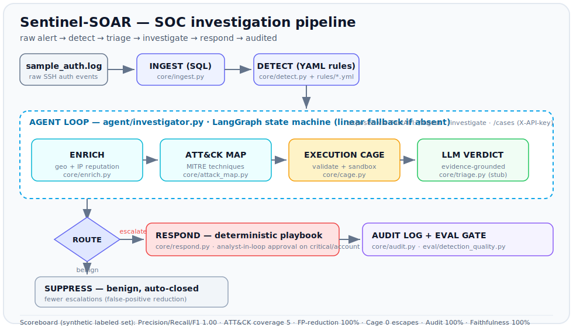

# Sentinel-SOAR

[](https://github.com/prajwal2105patil/sentinel-soar/actions/workflows/ci.yml)


**An AiStrike-mirroring mini SOAR** — a runnable, offline, zero-paid-key pipeline that reproduces the SOC loop **detect → triage → investigate → respond**, with a scoreboard that speaks AiStrike's metrics.

> Patterns adapted from my **DREADNOUGHT** data platform (SQL warehouse, YAML config, append-only audit log, execution cage). Sentinel-SOAR built by **Prajwal Patil**.
> Metrics below are computed on a **synthetic labeled alert set** (`data/labels.csv`) — they are engineering proof, **not** real-world SOC benchmarks.

---

## Architecture



```
sample logs → INGEST(SQL) → DETECT(YAML rules) → ENRICH(geo/reputation)
   → MAP(MITRE ATT&CK) → EXECUTION CAGE(safe analysis) → LLM AGENT verdict
   → ROUTE → RESPONSE PLAYBOOK(auto | analyst-in-loop) | SUPPRESS(benign) → AUDIT LOG + EVAL
```

## Module → AiStrike capability

| Module | What it does | AiStrike capability proven | Phase |
|---|---|---|---|
| `core/ingest.py` | Parse `sample_auth.log` → `events` table via SQL | SQL to extract & analyze security data | ✅ 1 |
| `detections/rules/*.yml` | Detection-as-code (thresholds, ATT&CK, escalation) | Deterministic YAML playbooks / detection engineering | ✅ 1 |
| `core/detect.py` | Interpret rules → flagged alerts | Detection + coverage | ✅ 1 |
| `core/triage.py` | LLM-stub verdict grounded in cited evidence | AI-driven triage (composite AI, provider-agnostic) | ✅ 1 |
| `core/audit.py` | Append-only audit log of every action | SOC 2 governance / audit trail | ✅ 1 |
| `detections/rules/impossible_travel.yml` | Geo/velocity detection-as-code | Detection engineering (2nd technique) | ✅ 2 |
| `core/enrich.py` | IP reputation / geo (mock + live opt-in) | Context enrichment | ✅ 2 |
| `core/attack_map.py` | Map detections → MITRE ATT&CK IDs | Map to ATT&CK attack chains | ✅ 2 |
| `core/cage.py` | Validate + sandbox the analysis step | Guardrailed / safe automation | ✅ 2 |
| `detections/rules/credential_review.yml` | Noisy review signal the agent auto-suppresses | Fewer escalations (FP reduction) | ✅ 3 |
| `agent/investigator.py` | LangGraph agent wiring the full loop | Composite-AI agent loop | ✅ 3 |
| `core/respond.py` + `playbooks/response/*.yml` | Deterministic response + analyst-in-loop approval | Response automation with control | ✅ 3 |
| `core/auth.py` | X-API-key gate (DREADNOUGHT pattern) | Access control | ✅ 3 |
| `api/app.py` | FastAPI `/ingest` `/investigate` `/cases` | Programmatic SOC surface | ✅ 3 |
| `eval/detection_quality.py` | Full scoreboard as a pass/fail gate | True-positive / fewer-escalations — quantified | ✅ 4 |
| `ml/` (`features` · `dataset` · `model`) | Real offline scikit-learn risk scorer over behavioural features | Basic ML in security / AI-driven detection | ✅ 5 |
| `cli/hunt.py` + `docs/hunt_queries.sql` | Parameterized SQL threat-hunting CLI over the event store | SQL to extract & analyze security data | ✅ 5 |
| `interop/` (`ecs` · `sigma`) + `cli/export.py` | Normalize events to ECS; export rules as Sigma | Ports into SIEM (Splunk/Elastic/Sentinel) | ✅ 5 |

## Run

```bash
pip install -r requirements.txt
python -m core.ingest              # logs -> data/events.db
python -m core.detect              # rules -> agent (enrich/correlate/ML/cage/verdict/response) -> scoreboard
python -m ml.train                 # train the ML risk scorer, print held-out metrics + coefficients
python -m cli.hunt top-talkers     # SQL threat-hunt CLI (spray / brute / users / timeline / cases / audit)
python scripts/fetch_public_sample.py && python -m core.ingest --log data/public/OpenSSH_2k.log --no-cloud
                                   # run on REAL public logs (loghub OpenSSH) — see docs/REAL_DATA.md
python -m cli.export sigma         # emit detections as Sigma rules (convertible to SPL/EQL/KQL)
python -m cli.export ecs --limit 20  # emit events normalized to Elastic Common Schema (ECS)
uvicorn api.app:app --reload       # API: /ingest /investigate /cases  (X-API-Key required)
python -m eval.detection_quality   # full §5 scoreboard gate (exits non-zero if any target missed)
```

Investigate a single alert over the API (key defaults to `dev-sentinel-key`, override with `SENTINEL_API_KEY`):

```bash
curl -s -X POST localhost:8000/investigate -H "X-API-Key: dev-sentinel-key" \
  -H "Content-Type: application/json" \
  -d '{"rule_id":"RULE-BRUTE-FORCE-001","source_ip":"45.133.1.88","event_count":6,
       "severity":"critical","username":"postgres",
       "evidence":{"event_ids":[17,18,19],"targeted_users":["postgres"],
                   "success_after_failures":{"username":"postgres","ts":"2025-06-14T09:05:40+00:00"}}}'
# -> verdict + ATT&CK techniques + response playbook; critical actions flagged requires_approval
```

**Acceptance:** `python -m core.ingest && python -m core.detect` flags alerts each carrying a verdict (Phase 1); every alert gets enrichment + an ATT&CK ID and the cage contains malformed input with 0 escapes (Phase 2); `POST /investigate` returns verdict + ATT&CK + recommended response with critical actions gated for human approval (Phase 3).

## Scoreboard

Live metrics (run `python -m eval.detection_quality`) on the synthetic labeled set. The labeled set deliberately includes one below-threshold false-negative and one noisy false-positive, so detection scores are an honest **0.90** — not a suspicious 1.00.

**Rule detection** (escalated alerts vs `data/labels.csv`):

| Metric | Target | Result |
|---|---|---|
| Detection Precision / Recall / F1 | ≥ 0.90 / 0.85 / 0.87 | **0.90 / 0.90 / 0.90** |
| ATT&CK Coverage | ≥ 5 | **7** techniques |
| Enrichment Success | ≥ 95% | **100%** |
| False-Positive Reduction | ≥ 70% | **75%** (benign noise auto-suppressed) |
| Cage Containment | 0 escapes | **0** |
| Auto-Triage Rate | ≥ 80% | **85.7%** |
| Audit Completeness | 100% | **100%** |
| Mean Time To Triage | < 5 s | **~27 ms** |
| Verdict Faithfulness | ≥ 0.90 | **1.0** by construction |

**ML risk scorer** (held-out split of a synthetic feature set — see `ml/`):

| Metric | Target | Result |
|---|---|---|
| ML Precision / Recall / ROC-AUC (held-out) | ≥ 0.80 / 0.80 / 0.85 | **0.85 / 0.90 / 0.90** |
| False-negative recovery | — | **1/1** rule-missed attack flagged high-risk, **0** new false alarms |

> **Why the ML matters:** the signature rules miss a deliberate *low-and-slow* brute force (`62.4.5.9` — 4 failures spaced 90 s apart, below the 5-in-120 s threshold). The behavioural model scores it **0.78 (high)** and recovers it, without pushing any legitimate user into the high band. That is the honest "where ML beats signatures" result — not a stub labelled "AI."

## Tests & CI

```bash
pip install -r requirements-dev.txt
python -m pytest -q                  # 62 tests: pipeline, cage, enrich, respond, triage, API, ML, SQL hunts, real-log ingest, ECS/Sigma
python -m eval.detection_quality     # the scoreboard gate (exit 0 = all targets met)
```

GitHub Actions ([`.github/workflows/ci.yml`](.github/workflows/ci.yml)) runs on every push/PR to `main` across **Python 3.11 and 3.12**: it installs deps, runs the full `pytest` suite, then runs the detection-quality gate — so a regression that drops any §5 metric below target **fails the build**.

## Build status

- **Phase 1 — Core loop (MVP):** ✅ ingest, one rule, detect, LLM triage stub, audit log.
- **Phase 2 — Investigation depth:** ✅ impossible-travel rule, geo/reputation enrichment, ATT&CK map, execution cage.
- **Phase 3 — Agent + response:** ✅ LangGraph investigator, response playbooks + analyst-in-loop approval, FastAPI `/ingest` `/investigate` `/cases` with X-API-key.
- **Phase 4 — Proof polish:** ✅ `eval/detection_quality.py` full §5 scoreboard gate (all targets PASS, exit 0); README architecture diagram + module→capability table + scoreboard. *(Remaining: record the 90-sec walkthrough — a manual step.)*

## Honesty & attribution

The claim is the **engineering**: guarded AI-agent automation for the SOC loop, with measured detection quality. It is **not** production SOC experience, and the metrics are computed on a **synthetic labeled set**, not real-world traffic.
